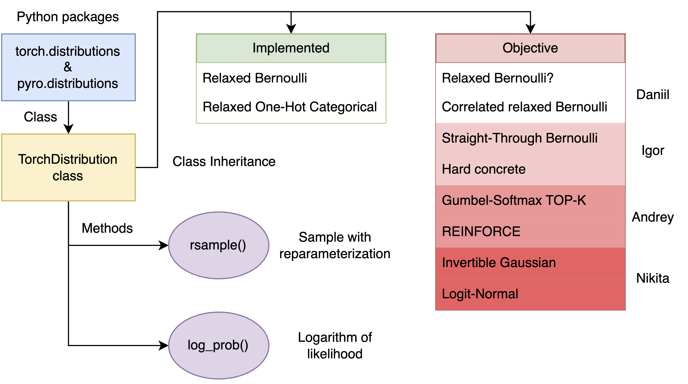

# Project planning

In this file, we provide information about the planning of our work on the library named **Just Relax It** (`relaxit`). 

Since its implementation is carried out as a part of [BMM](https://github.com/intsystems/BMM) course, we consider it a full-fledged project named **Discrete variables relaxation** and therefore make detailed, long-term planning. 

This document is structured as follows:

1. [Motivation](#motivation)
2. [Algorithms to implement](#algorithms)
3. [Architecture of the project](#architecture)

## Motivation  <a name="motivation"></a>

For lots of mathematical problems we need an ability to sample discrete random variables.
For instance, we may consider a VAE architecture with discrete latent space, e.g. Bernoulli or categorical.
The problem is that due to continuos nature of deep learning optimization, the usage of truely discrete random variables is infeasible. 
In particular, after sampling a variable from discrete distribution, we have not an ability to calculate the gradient through it.
Thus we use different relaxation methods.

## Algorithms to implement (from simplest to hardest) <a name="algorithms"></a>

In this project, we are going to implement the following algorithms:
1. [Relaxed Bernoulli](http://proceedings.mlr.press/v119/yamada20a/yamada20a.pdf)
2. [Correlated relaxed Bernoulli](https://openreview.net/pdf?id=oDFvtxzPOx)
3. [Gumbel-softmax TOP-K](https://arxiv.org/pdf/1903.06059)
4. [Straight-Through Bernoulli, distribution (don't mix with Relaxed distribution from pyro)](https://citeseerx.ist.psu.edu/document?repid=rep1&type=pdf&doi=62c76ca0b2790c34e85ba1cce09d47be317c7235)
5. [Invertible Gaussian reparametrization](https://arxiv.org/abs/1912.09588) with KL implemented
6. [Hard concrete](https://arxiv.org/pdf/1712.01312)
7. [REINFORCE](http://www.cs.toronto.edu/~tingwuwang/REINFORCE.pdf)  (not a distribution actually, think how to integrate it with other distributions)
8. [Logit-normal distribution](https://en.wikipedia.org/wiki/Logit-normal_distribution) with KL implemented and [Laplace-form approximation of Dirichlet](https://stats.stackexchange.com/questions/535560/approximating-the-logit-normal-by-dirichlet)

You are invited to track our progress on the [main page](https://github.com/intsystems/discrete-variables-relaxation/tree/main?tab=readme-ov-file#-algorithms-to-implement-from-simplest-to-hardest).

## Architecture of the project <a name="architecture"></a>

1. The most famous Python probabilistic libraries with a built-in differentiation engine are [PyTorch](https://pytorch.org/docs/stable/index.html) and [Pyro](https://docs.pyro.ai/en/dev/index.html). Specifically, we are mostly interested in the `distributions` package in both of them.
2. Base class for PyTorch-compatible distributions with Pyro support is `TorchDistribution`, for which we refer to [this page](https://docs.pyro.ai/en/dev/distributions.html#torchdistribution) on documentation. This should be the base class for almost all new Pyro distributions. Therefore in our project we are planning to inherit classes from this specific one.
3. To make our library compatible with modern deep learning packages, we will implement our classes with the following methods and properties, as it is mentioned in the Pyro documentation:
  > Derived classes must implement the methods `sample()` (or `rsample()` if `.has_rsample == True`) and `log_prob()`, and must implement the properties `batch_shape`, and `event_shape`. Discrete classes may also implement the `enumerate_support()` method to improve gradient estimates and set `.has_enumerate_support = True`.

```python
def rsample(self, sample_shape: _size = torch.Size()) -> torch.Tensor:
    """
    Generates a sample_shape shaped reparameterized sample or sample_shape
    shaped batch of reparameterized samples if the distribution parameters
    are batched.
    """
    raise NotImplementedError
```

```python
def log_prob(self, value: torch.Tensor) -> torch.Tensor:
    """
    Returns the log of the probability density/mass function evaluated at
    `value`.
    
    Args:
        value (Tensor):
    """
    raise NotImplementedError
```

> [!NOTE]
> Below we present a diagram of the implementation of our project, demonstrating the class inheritance, as well as the methods necessary for implementation.


