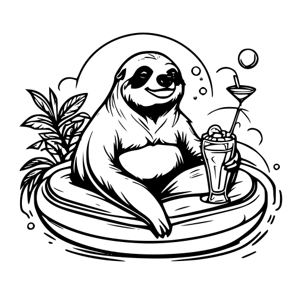

  
    
    <h1> Just Relax It </h1>
    Discrete variables relaxation

## 📬 Assets

1. [Technichal Meeting 1 - Presentation](https://github.com/intsystems/discrete-variables-relaxation/blob/main/assets/presentation_tm1.pdf)
2. [Technichal Meeting 2 - Jupyter Notebook](https://github.com/intsystems/discrete-variables-relaxation/blob/main/basic/basic_code.ipynb)
3. [Blog Post](https://github.com/intsystems/discrete-variables-relaxation/blob/main/assets/blog-post.pdf)
4. [Documentation](https://intsystems.github.io/discrete-variables-relaxation/)
5. [Tests](https://github.com/intsystems/discrete-variables-relaxation/tree/main/tests)

## 💡 Motivation
For lots of mathematical problems we need an ability to sample discrete random variables. 
The problem is that due to continuos nature of deep learning optimization, the usage of truely discrete random variables is infeasible. 
Thus we use different relaxation method. 
One of them, [Concrete distribution](https://arxiv.org/abs/1611.00712) or [Gumbel-softmax](https://arxiv.org/abs/1611.01144) (this is one distribution proposed in parallel by two research groups) is implemented in different DL packages. 
In this project we implement different alternatives to it. 

  
    

## 🗃 Algorithms to implement (from simplest to hardest)
- [x] [Relaxed Bernoulli](http://proceedings.mlr.press/v119/yamada20a/yamada20a.pdf) 
- [ ] [Correlated relaxed Bernoulli](https://openreview.net/pdf?id=oDFvtxzPOx)
- [ ] [Gumbel-softmax TOP-K](https://arxiv.org/pdf/1903.06059) 
- [x] [Straight-Through Bernoulli, distribution (don't mix with Relaxed distribution from pyro)](https://citeseerx.ist.psu.edu/document?repid=rep1&type=pdf&doi=62c76ca0b2790c34e85ba1cce09d47be317c7235) 
- [ ] [Invertible Gaussian reparametrization](https://arxiv.org/abs/1912.09588) with KL implemented
- [x] [Hard concrete](https://arxiv.org/pdf/1712.01312) 
- [ ] [REINFORCE](http://www.cs.toronto.edu/~tingwuwang/REINFORCE.pdf)  (not a distribution actually, think how to integrate it with other distributions)
- [ ] [Logit-normal distribution](https://en.wikipedia.org/wiki/Logit-normal_distribution) with KL implemented and [Laplace-form approximation of Dirichlet](https://stats.stackexchange.com/questions/535560/approximating-the-logit-normal-by-dirichlet) 

## 📚 Recommended stack
Some of the alternatives for GS were implemented in [pyro](https://docs.pyro.ai/en/dev/distributions.html), so it might be useful to play with them also.
  
## 🧩 Problem details
To make to library constistent, we integrate imports of distributions from pyro and pytorch into the library, so that all the categorical distributions can be imported from one entrypoint. 

## 👥 Contributors
- [Daniil Dorin](https://github.com/DorinDaniil) (Basic code writing, Final demo, Algorithms)
- [Igor Ignashin](https://github.com/ThunderstormXX) (Project wrapping, Documentation writing, Algorithms)
- [Nikita Kiselev](https://github.com/kisnikser) (Project planning, Blog post, Algorithms)
- [Andrey Veprikov](https://github.com/Vepricov) (Tests writing, Documentation writing, Algorithms)

## 🔗 Useful links
- [About top-k GS](https://uvadlc-notebooks.readthedocs.io/en/latest/tutorial_notebooks/DL2/sampling/subsets.html) 
- [VAE implementation with different latent distributions](https://github.com/kampta/pytorch-distributions)
- [KL divergence between Dirichlet and Logistic-Normal implemented in R](https://rdrr.io/cran/Compositional/src/R/kl.diri.normal.R)
- [About score function (SF) and pathwise derivate (PD) estimators, VAE and REINFORCE](https://arxiv.org/abs/1506.05254)
